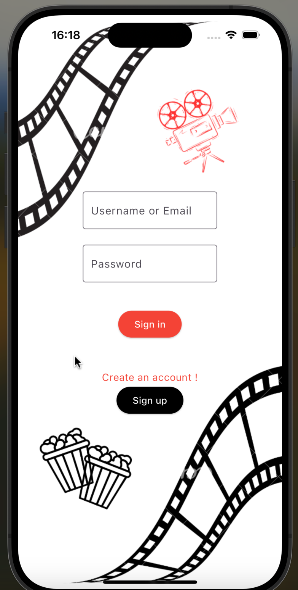
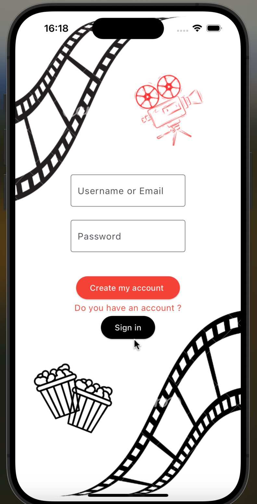
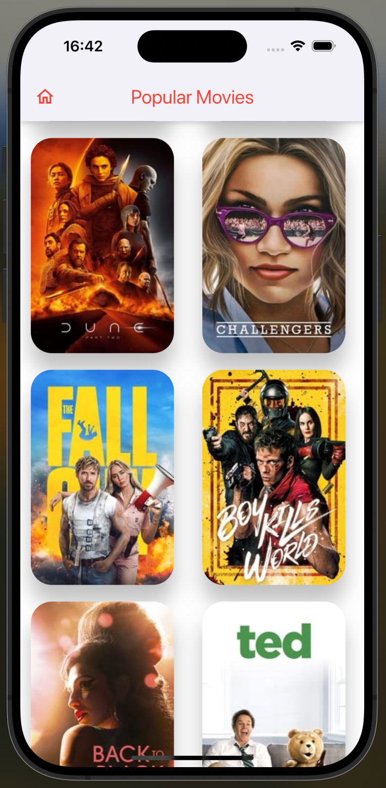

# Hi 👋🏼

- [TR : Açıklama :boom:](#tr)
- [EN : Description :boom:](#en)  

****

 #### [TR]

# Movie application developed using Flutter
👩🏽‍💻 Bu uygulama, TMDB API'sini kullanarak popüler filmleri ve detaylarını listeleyen
bir film listesi uygulamasıdır.

--🔑 Login işlemleri için Firebase authentication kullanılmıştır.
--💥 Splash Screen için Lottie kütüphanesini kullanılmıştır.

🛠️❗️ Firebase yapılandırma bilgilerini projenize eklerken veya güncellerken, dikkatlice işlem yapın ve güvenlik önlemlerini uygulayın. Hassas bilgileri eklememeye özen gösterin. Ayrıca, Firebase yapılandırma bilgilerini sürdürülebilir ve güvenli bir şekilde yönetmek için çevresel değişkenler veya güvenli depolama yöntemlerini kullanabilirsiniz.


1. **Kurulum**
   
   Projeyi klonlayın ve gerekli paketleri yükleyin:
   ```bash
   git clone https://github.com/melikeyogurtcu/movie-app.git 

2. **Gerekli paketleri yükleyin:**

    ```bash
   flutter pub get

## Görseller

**Splash Screen**

|  |

**Login & Register Screen**

| |  |

**Home Screen**

|  |

**Projeye Genel Bakış**

|  |

**İletişim**
- **Melike Yoğurtcu** [@melikeyogurtcu](https://github.com/melikeyogurtcu)


****

 #### [EN]

👩🏽‍💻 This application is a movie list application that uses 
the TMDB API to list popular movies and their details.

--🔑 Firebase authentication is used for login operations.
--💥 The Lottie library is used for the Splash Screen.

🛠️❗️ When adding or updating Firebase configuration information to your project, proceed carefully and implement security measures. Be cautious not to include sensitive information. Additionally, to manage Firebase configuration information sustainably and securely, you can use environment variables or secure storage methods.

1. **Setup**
   
   Clone the project and install the necessary packages:
   ```bash
   git clone https://github.com/melikeyogurtcu/movie-app.git 

2. **Install the necessary packages:**

    ```bash
   flutter pub get 

## Images

**Splash Screen**

|  |

**Login & Register Screen**

| |  |

**Home Screen**

|  |

**Projeye Genel Bakış**

|  |

**Contact**
- **Melike Yoğurtcu** [@melikeyogurtcu](https://github.com/melikeyogurtcu)


 